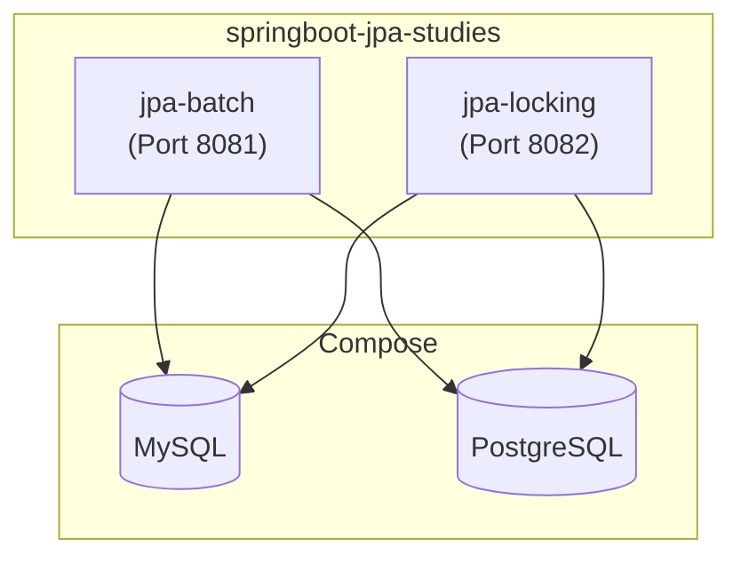

# springboot-jpa-studies

[](LICENSE)
[](https://buymeacoffee.com/ivan.franchin)

The goal of this project is to study `JPA Batch Processing` (i.e., inserting, updating, or deleting a set of records in a single command) and `JPA Locking`.

## Proof-of-Concepts & Articles

On [ivangfr.github.io](https://ivangfr.github.io), I have compiled my Proof-of-Concepts (PoCs) and articles. You can easily search for the technology you are interested in by using the filter. Who knows, perhaps I have already implemented a PoC or written an article about what you are looking for.

## Additional Readings

- \[**Medium**\] [**Batch Processing with JPA and Hibernate**](https://medium.com/itnext/batch-processing-with-jpa-and-hibernate-0831e219586c)

## Project Overview



## Modules

- ### [jpa-batch](https://github.com/ivangfr/springboot-jpa-studies/tree/master/jpa-batch#jpa-batch)

  ```mermaid
  erDiagram
      Partner ||--o{ VoucherCode : has
      Partner {
          Long id PK
          String name
      }
      VoucherCode {
          Long id PK
          String code
          boolean deleted
          Long partner_id FK
      }
  ```

- ### [jpa-locking](https://github.com/ivangfr/springboot-jpa-studies/tree/master/jpa-locking#jpa-locking)

  ```mermaid
  erDiagram
      Player ||--o{ StarCollection : collects
      StarCollection {
          Long id PK
          Integer numCollected
          Integer numAvailable
          Long version
          Long player_id FK
      }
      Player ||--o{ Life : claims
      Player {
          Long id PK
          String username
      }
      Life {
          Long id PK
          Long version
          Long player_id FK "nullable"
      }
  ```

## Prerequisites

- [`Java 25`](https://www.oracle.com/java/technologies/downloads/#java25) or higher;
- A containerization tool (e.g., [`Docker`](https://www.docker.com), [`Podman`](https://podman.io), etc.)

## Start Environment

Open one terminal and inside the `springboot-jpa-studies` root folder run:
```bash
docker compose up -d
```

## Useful Commands

- **MySQL**

  - Run `MySQL` interactive terminal (`mysql`)
    ```bash
    docker exec -it -e MYSQL_PWD=secret mysql mysql -uroot --database studiesdb
    ```
    > Type `exit` to exit
    
- **PostgreSQL**

  - Run `Postgres` interactive terminal (`psql`)
    ```bash
    docker exec -it postgres psql -U postgres -d studiesdb
    ```
    > Type `\q` to exit

## Shutdown Environment

- In a terminal, make sure you are inside the `springboot-jpa-studies` root folder;

- To stop and remove docker compose containers, networks and volumes, run:
  ```bash
  docker compose down -v
  ```

## Running tests

- In a terminal, make sure you are in the `springboot-jpa-studies` root folder;

- The commands below will run the test cases of all modules. In order to run just the tests of a specific module check the module README;

  During the tests, [`Testcontainers`](https://testcontainers.com) automatically starts Docker containers of the databases before the tests begin and shuts the containers down when the tests finish;

  - **Using MySQL**
    ```bash
    ./mvnw clean test -DargLine="-Dspring.profiles.active=mysql-test"
    ```

  - **Using PostgreSQL**
    ```bash
    ./mvnw clean test -DargLine="-Dspring.profiles.active=postgres-test"
    ```

## Code Formatting

This project enforces consistent Java formatting using the [Spotless](https://github.com/diffplug/spotless) Maven plugin with [google-java-format](https://github.com/google/google-java-format) (GOOGLE style).

- **Check formatting**:
  ```bash
  ./mvnw spotless:check
  ```

- **Auto-fix formatting**:
  ```bash
  ./mvnw spotless:apply
  ```

Formatting is enforced automatically during `./mvnw verify`.

## Support

If you find this useful, consider buying me a coffee:

<a href="https://buymeacoffee.com/ivan.franchin"></a>

## License

This project is licensed under the [MIT License](./LICENSE).
